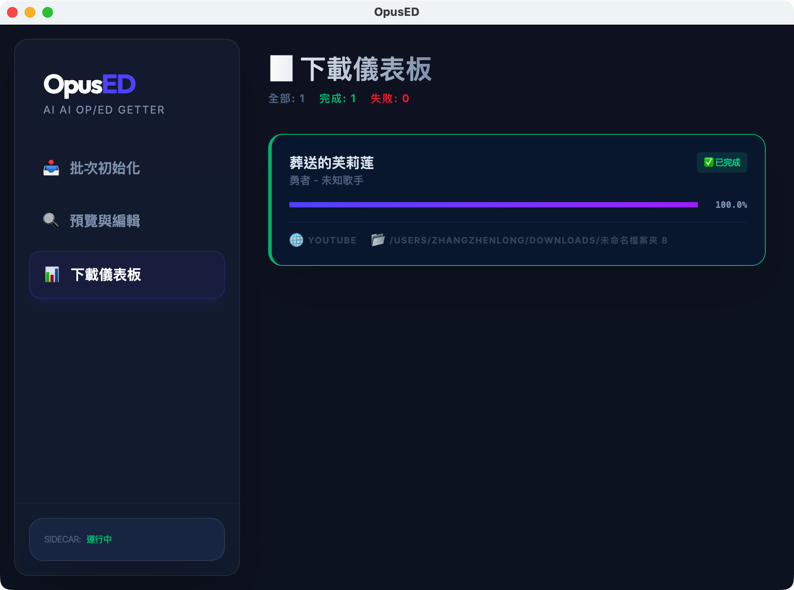
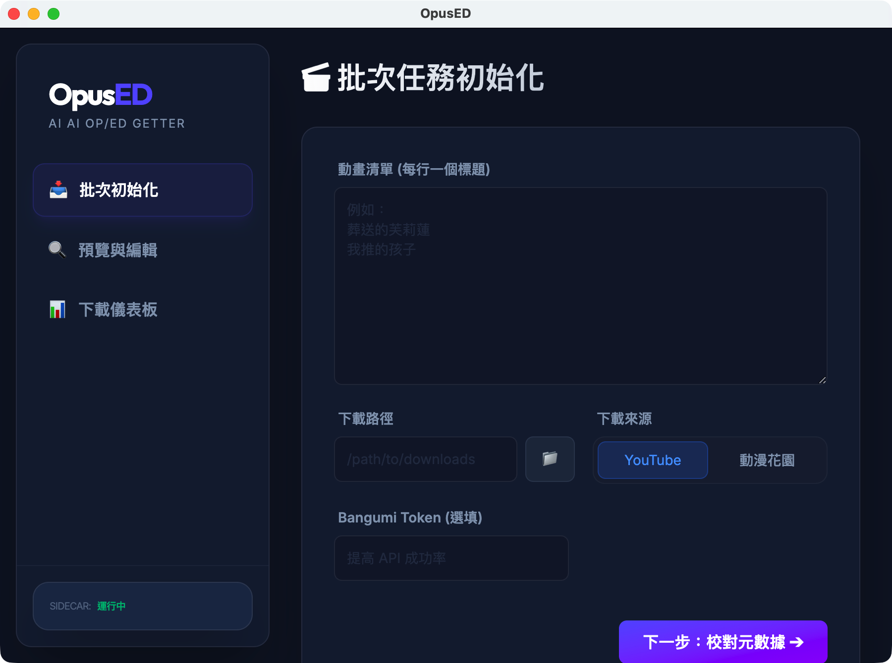
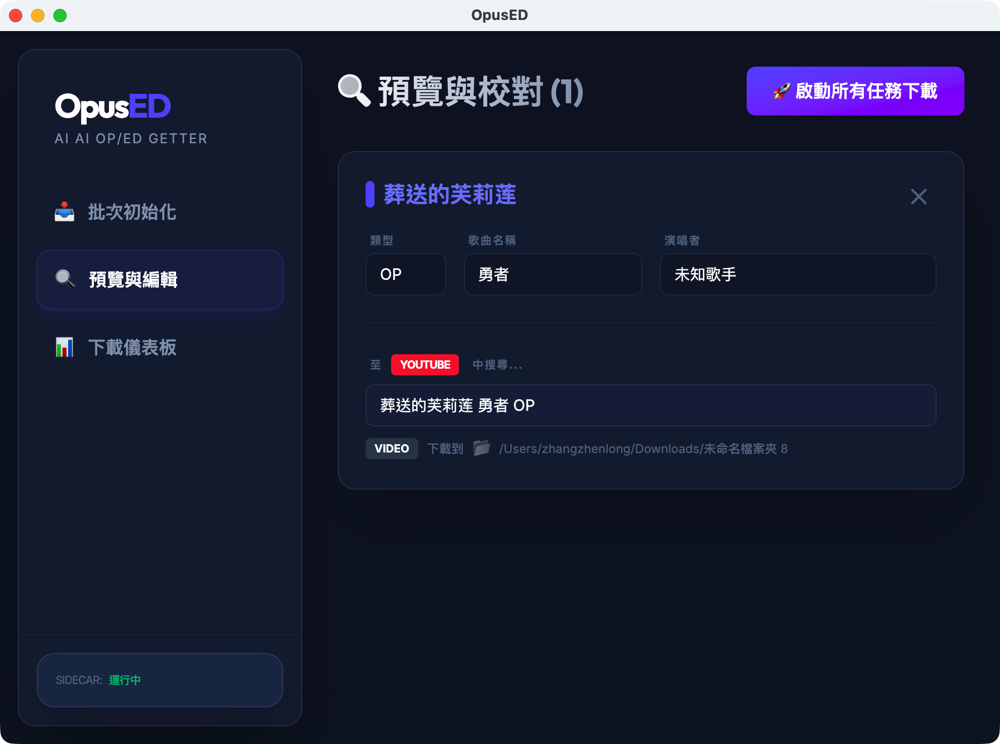

# OpusED

OpusED is a modern tool designed to fetch and manage Anime Opening and Ending (OP/ED) themes effortlessly.

[繁體中文版 (README-zhTW.md)](README-zhTW.md)

## 📥 Download & Installation

For regular users, please visit our **[Releases Page](https://github.com/twkevinzhang/opus-ed/releases)** to download the latest version for your operating system.

---

## 🚀 How to Use

### 1. Dashboard Overview

Upon launching the app, you'll see a clean dashboard providing an overview of your current tasks and sidecar status.

### 2. Batch Task Initialization

Enter your anime titles (one per line). Choose your source (YouTube or DMHY) and set your download path.

> [!TIP]
> The download path now defaults to your system's "Downloads" folder!

### 3. Metadata Preview & Edit

Before starting the download, you can preview and edit the metadata to ensure everything is correct.

---

## ✨ Key Features

- **Batch Processing**: Search for multiple anime titles at once.
- **Multiple Sources**: Integrated support for YouTube (via yt-dlp) and DMHY.
- **Modern UI**: A premium Electron + Vue 3 experience with dark mode and smooth animations.
- **Smart Defaults**: Intelligent path handling and metadata fetching.

## 🛠️ Developer Guide

If you wish to contribute or build from source:

- **[DEVELOPMENT.md](DEVELOPMENT.md)**: Setup and local execution.
- **[CONTRIBUTING.md](CONTRIBUTING.md)**: Standards and conventions.

---

_Helping anime lovers collect their favorite tunes since 2026._
